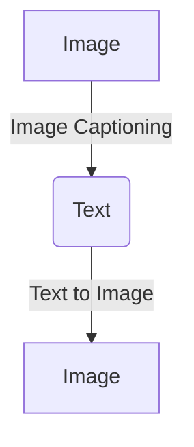
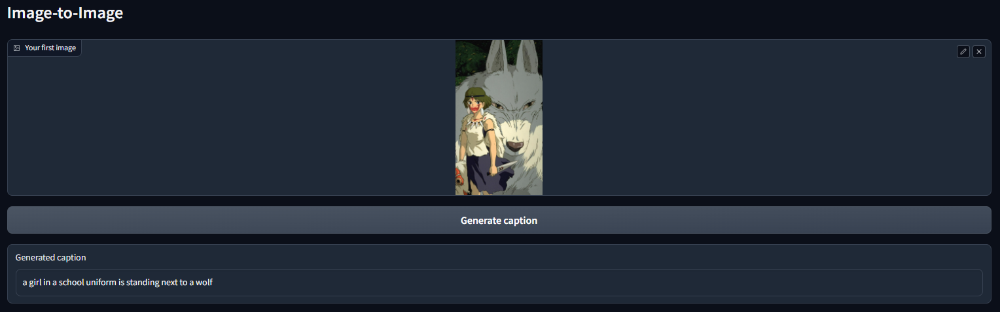
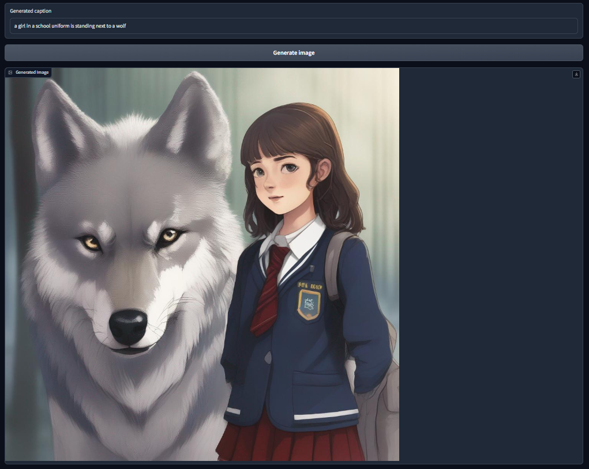

# Image to Text then Image with Hugging Face API

<!-- TABLE OF CONTENTS -->
<details>
  <summary>Table of Contents</summary>
  <ol>
    <li><a href="#about-the-project">About The Project</a>
    <li><a href="#image-captioning">Image Captioning</a>
    <li><a href="#text-to-image">Text to Image</a>
    <li><a href="#installation">Installation</a>
    <li><a href="#usage">Usage</a></li>
  </ol>
</details>

<!-- ABOUT THE PROJECT -->
## About The Project

This project demonstrates how to captioning an image then re-generate the caption into image using Hugging Face API 🤗 for image captioning model and text-to-image model. Also use Gradio ⚡ for UI demo.



<p align="right">(<a href="#readme-top">back to top</a>)</p>


<!-- IMAGE CAPTIONING -->
## Image Captioning

For image captioning task, I use the [BLIP Image Captioning Base](https://huggingface.co/Salesforce/blip-image-captioning-base)

### BLIP: Bootstrapping Language-Image Pre-training for Unified Vision-Language Understanding and Generation
"Model card for image captioning pretrained on COCO dataset - base architecture (with ViT base backbone)"

<br />
<div align="center">
  <a>
    
  </a>
  <h4 align="center">BLIP Architect</h4>

  <a>
    
  </a>
  <h4 align="center">Gradio Image Captioning task</h4>
</div>

<p align="right">(<a href="#readme-top">back to top</a>)</p>


<!-- TEXT TO IMAGE -->
## Text to Image

For text to image task, I use the [Stable Diffusion XL Base](https://huggingface.co/stabilityai/stable-diffusion-xl-base-1.0)

### SD-XL 1.0-base Model Card
"SDXL consists of an ensemble of experts pipeline for latent diffusion: In a first step, the base model is used to generate (noisy) latents, which are then further processed with a refinement model specialized for the final denoising steps. Note that the base model can be used as a standalone module"

<br />
<div align="center">
  <a>
    
  </a>
  <h4 align="center">SDXL Architect</h4>

  <a>
    
  </a>
  <h4 align="center">Gradio Text2Image task</h4>
</div>

<p align="right">(<a href="#readme-top">back to top</a>)</p>

<!-- INSTALLATION -->
## Installation

You can install the required libraries using pip:

```bash
pip install -r requirements.txt
```

Or you can use the prepared install statement in the Makefile using the command:

```bash
make install
```

<p align="right">(<a href="#readme-top">back to top</a>)</p>


<!-- USAGE -->
## Usage

1. Clone this repository:

```bash
git clone https://github.com/ToThieHien/img-text-img-api.git
cd img-text-img-api
```

2. Create `.env` file then assign your Huggingface Access Tokens

```env
HF_API_KEY = {Your HF Access Tokens}
```
You can create new access tokens with role "write" by the following link
[Huggingface Access Tokens](https://huggingface.co/settings/tokens)

3. Run the `app.py` file to start the Gradio app:

```bash
python app.py
```

4. Open your web browser and visit the local URL to access the Gradio interface

5. Upload an image then feel free to try our demo

<p align="right">(<a href="#readme-top">back to top</a>)</p>

